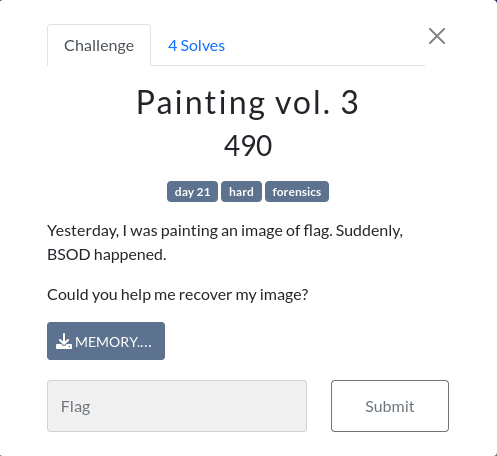
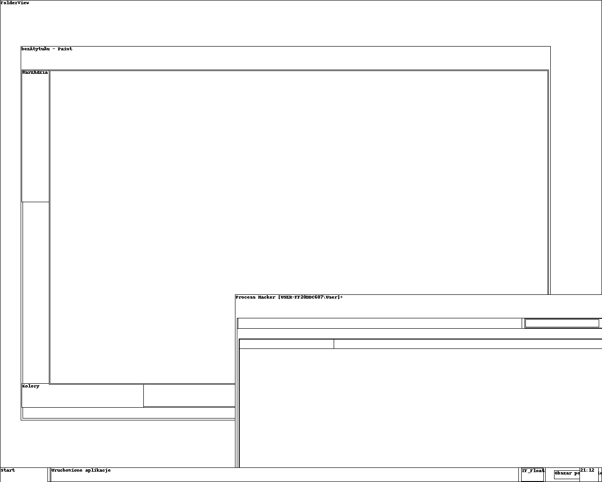

# Painting vol.3


Do wyciągnięcia potrzebnych informacji z pliku użyjemy narzędzia "volatility".
Najpierw powinno się sprawdzić, jak wyglądał ekran przed crashem.
Wykonując polecenie "screenshot" i sprawdzając "session_0.WinSta0.Default.png" zobaczymy to:


Tak jak sam opis mówi i zdjęcia potwierdza, należy znaleźć pamięć należącą do Painta. Do tego potrzeba najpierw znaleźć jego PID.
Sprawdzając listę procesów ("pslist") uzyskamy to:

```
Offset(V)  Name                    PID   PPID   Thds     Hnds   Sess Start                          
---------- -------------------- ------ ------ ------ -------- ------ ----------------------------
0x81f26020 mspaint.exe            1756   1268      6      108      0 2023-12-20 20:10:15 UTC+0000
```

Należy następnie wyeksportować pamięć za pomocą komendy "memdump" i otworzyć wyeksportowany plik w GIMPie (jeszcze trzeba zmienić roszerzenie na ".dat").

Ustawienia, które należy wprowadzić w wyskakującym okienku:

```
Type: RGB565 Big Endian
Offset: 1883041
Width: 1550
Height: 498
```

Po odwróceniu zdjęcia uzyskujemy flagę.

Źródło: https://bananamafia.dev/post/mem/

Flaga: `WSIZ{v0lat1l3_m3m0ry}`