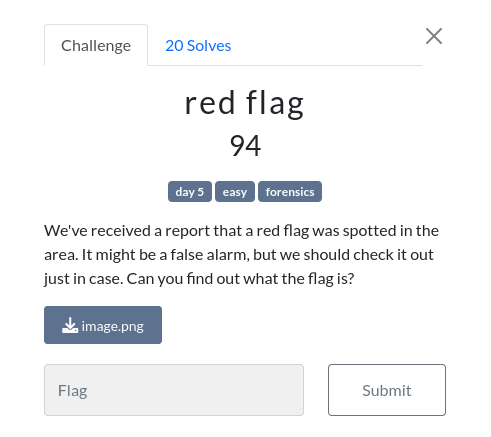
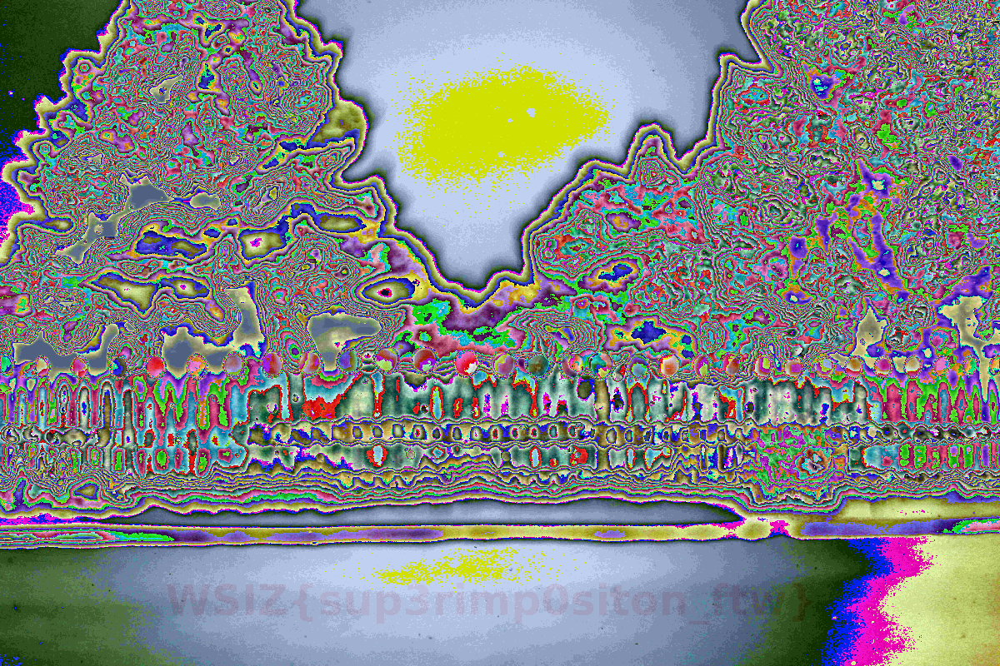

# red flag

Jeżeli podane jest zdjęcie, sposobem ukrycia pliku może być steganografia.
Sprawdzenie pliku komendą `binwalk image.png` nie pokazuje żadnych ciekawych plików.

Zdjęcie zostało sprawdzone z użyciem strony https://stegonline.georgeom.net/.
Po kliknięciu "LSB Half" pojawia się to:

Flaga: `WSIZ{sup3rimp0siton_ftw}`